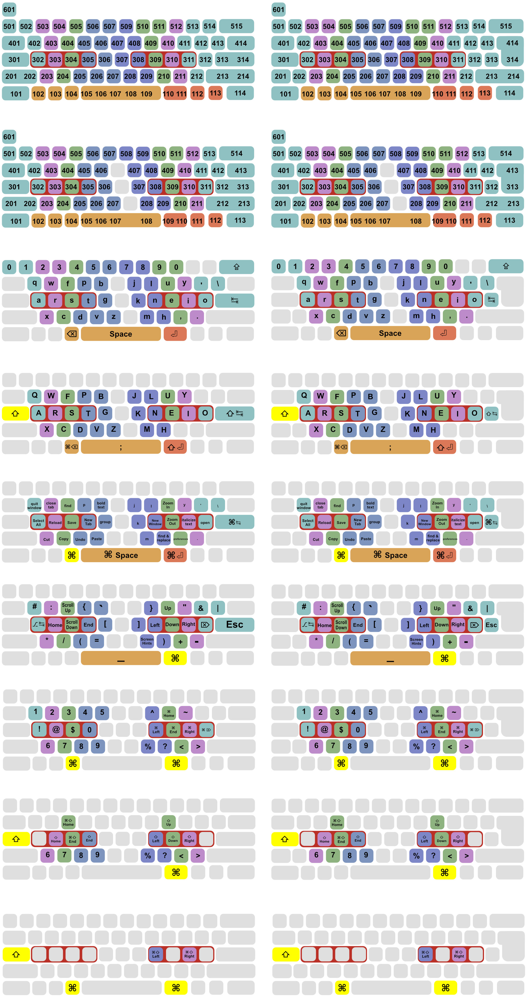

# Colemak-Im

This project proposes a cost-effective and ergonomic keyboard layout ‘Colemak-Im’ to address issues in current layouts. However, this keyboard layout is still premature for wide-scale use.

Kindly view the [license](./license.txt) before proceeding.

https://github.com/AhmedThahir/keyboard/blob/f2cc3a0c6dab9f07dfbd24bb33ca6ed0b5298e69/license.txt#L5

